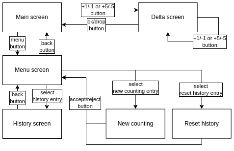

# esp32-counter

This project implements a physical digital counter for board games like pathfinder/D&D and others.
It could be used to count damage, hp, magical points, etc.

This digital counter tracks history and automates addition, reducing human-error factor.

To build a counter you need:
- esp32 board (checked with esp32-Wrover module)
- 3 press buttons
- I2C 128x64 OLED display (checked with display based on SH1106G driver)
- Optional I2C FRAM module (checked with MB85RC256 breakout board)

Other hardware is possible, but may require some hacking(see `hal.h` and `esp32-counter.ino` files).

FRAM module is optional. If not connected counter state and history will not be saved when power is removed.

## GUI

GUI interface contains several "screens" which displays various things, like current counter status, change history or reseting counter state.

There are six screens in total:

- Main screen. Contains current counter value and a short history for current counting session. if +1/-1 or +5/-5 buttons are pressed, GUI switches to the Delta screen;
- Delta screen. Contains current coutner value, delta value and controls to change or accept/decline this delta. After confirmation counter is changed and new value added to the history;
- Menu screen;
- History screen. Shows full history of multiple countings, since last resetting of the history;
- Reset history screen. At this screen you will be asked for a confirmation to erase counting history;
- New counting screen. At this screen you will be asked for a confirmation to zero counter and start new counting. Full history is preserved.

Left and middle buttons on Main and Delta screen have two states:

- short press adds value to the delta;
- long press decrements the delta.



## Build

### Arduino IDE

This is a release build for hardware.

Dependencies:
- ESP32 board support in arduino IDE
- https://github.com/adafruit/Adafruit_SH110X
- https://github.com/adafruit/Adafruit_FRAM_I2C

### How do I hook up my board with ESP32-WROVER?

#### Display

| OLED Pin | GPIO |
| -------- | ---- |
| SDA      |  21  |
| CLK      |  22  |

#### FRAM

| FRAM Pin | GPIO |
| -------- | ---- |
| SDA      |  21  |
| CLK      |  22  |

#### BUTTONS

Buttons use builtin pull up resistors, no need to add external ones.

Each button is connected to the grond and corresponding pin on the board.

| Button | GPIO |
| ------ | ---- |
| left   |  12  |
| middle |  27  |
| right  |  14  |

#### OTHERS

There are one additional pin used for battery voltage monitoring.

GPIO 34 is attached to battery positive terminal.

### How do I hook up my board with other hardware?

Need to modify defines in `esp32-counter.ino` file and hardware specific libraries in `hal.h`.

### CMake build

This build is for **debug** purposes only.

Build and run tests:

```
sudo apt install libgtest-dev libgmock-dev
mkdir build
cd build
cmake ..
make
./counter_tests
```

## SW Architecture

Counter contains five modules:

- `widgets`: contains implemnetation of simple graphical elements, such as labels, item lists, button state representation, etc.;
- `screens`: contains implementation of screen, described below;
- `counter_gui`: contains logic that glues screens together. I.e. defines functions switching between screens and controls counter state and history.
- `state`: containes hardware independent algorithms for saving and restoring of counter state in persistent memory.
- `hal` + `esp32-counter.ino`: contains hardware specific stuff, like mapping between buttons and hardware pins, low-level hardware functions, etc.
